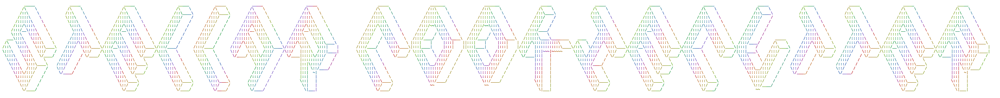

# Stellar Cookiecutter Project
This is a template cookiecutter project that's been forked from the original
[repo](https://github.com/audreyfeldroy/cookiecutter-pypackage.git). This is useful for my needs and utilises modern
Python tooling in 2025. 

## Features

*   uv, ruff and ty for tooling
*   Testing setup with pytest
*   GitHub Actions testing: Setup to easily test for Python 3.10, 3.11, 3.12, and 3.13
*   Command line interface using Typer
*   Pre-commit hooks

## Quickstart

Install the latest Cookiecutter if you haven't installed it yet:

```bash
pip install -U cookiecutter
```

Generate a Python package project:

```bash
cookiecutter https://github.com/sprckt/stellar-cookiecutter
```

And voila you have a modern Python project with all the trimmings.